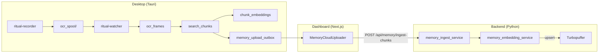

# Fix Ritual Recorder Vector + Hybrid Search Bottlenecks

## Architecture Overview




The pipeline flows: **Capture -> OCR -> Chunks -> Local Embed -> Outbox -> Upload -> Cloud Ingest -> Cloud Embed -> Turbopuffer**. The end-to-end lag across all stages causes `cloud_candidates=0` for recent queries.

---

## Bottleneck 1: Pipeline Freshness Gap (Highest Priority)

### Root Cause

The cumulative lag across stages is too high:

- **Local chunking** rebuilds with a 7-day lookback (`CHUNK_REBUILD_LOOKBACK_MS` in [vector.rs](apps/desktop/src-tauri/crates/ritual-db/src/vector.rs)) which is expensive per tick
- **Local embedding** processes 64 chunks/batch with 500ms-30s sleep between batches ([ritual_database.rs EmbeddingWorker](apps/desktop/src-tauri/src/ritual_database.rs))
- **Outbox seeding** scans 300 chunks max per cycle; claiming 120 per POST ([memory-cloud-uploader.tsx](apps/dashboard/components/memory-cloud-uploader.tsx))
- **Cloud embedding** processes 32-256/batch with 1-20s sleep ([main.py lines 329-359](apps/backend/main.py))
- Net: with 1958 pending chunks, drain time is 30+ minutes even under ideal conditions

### Fix Plan

**A. Tighten local chunking lookback for the hot path** (`vector.rs`)

- Add a fast "incremental chunk" pass that only re-chunks frames from the last 30 minutes (instead of 7 days)
- Keep the 7-day rebuild as a periodic background reconciliation (every 5 minutes)
- New constant: `CHUNK_INCREMENTAL_LOOKBACK_MS = 30 * 60 * 1000`

**B. Increase outbox throughput** (`memory-cloud-uploader.tsx`)

- Raise `CLAIM_BATCH_LIMIT` from 120 to 256
- Raise `SEED_SCAN_LIMIT` from 300 to 600
- Lower `BUSY_INTERVAL_MS` from 3000 to 1500
- Lower `IDLE_INTERVAL_MS` from 15000 to 8000

**C. Increase cloud embedding throughput** (`main.py`)

- Lower the sleep floor from 1s to 0.5s when `pending > 2000`
- Add an "urgent drain" mode: when `pending > 500`, batch size 256 with 0.5s sleep

**D. Add priority lane for recent chunks** (`memory_embedding_service.py`)

- The existing `ORDER BY c.chunk_end_ts DESC` already prioritizes fresh chunks -- verify this is respected
- Add a "freshness-first" flag: when a query triggers `process_embedding_jobs_with_guard` inline, restrict the batch to chunks from the last 2 hours

**E. SLO enforcement** (new function in `memory_embedding_service.py`)

- Add `check_pipeline_slo()` returning: `{embed_lag_p95_seconds, pending_chunks, outbox_pending, meets_slo}`
- SLO targets: `embed_lag_p95 <= 300s`, `pending_chunks <= 200`, `outbox_pending drain <= 10 min`

---

## Bottleneck 2: Bridge Reliability Hardening

### Root Cause

The bridge starts once via `start_local_search_bridge_with_retry()` ([main.rs line 111](apps/desktop/src-tauri/src/main.rs)) with up to 8 attempts. But:

- No watchdog: if `tiny_http::Server` thread panics or the port is stolen after startup, bridge is gone for the session
- `BRIDGE_STARTED` atomic prevents restart even after failure
- Backend retry logic in `search_screen_via_hybrid_bridge_impl` ([watcher_service_search_utils.py](apps/backend/services/watcher_service_search_utils.py)) retries the HTTP call but cannot restart the server

### Fix Plan

**A. Add bridge health watchdog** (`local_search_bridge.rs` + `main.rs`)

- New function `bridge_health_check() -> bool` that pings `http://127.0.0.1:3031/health` with 2s timeout
- New background task in `main.rs` that runs every 30s: if `BRIDGE_STARTED` is true but health check fails, reset `BRIDGE_STARTED` to false and call `start_local_search_bridge_with_retry()` again
- Add `BRIDGE_RESTART_COUNT` atomic counter for observability

**B. Harden bridge thread** (`local_search_bridge.rs`)

- Wrap the `for request in server.incoming_requests()` loop in `std::panic::catch_unwind`
- On panic: log, reset `BRIDGE_STARTED`, allow watchdog to restart

**C. Add readiness probe** (`local_search_bridge.rs`)

- Add `GET /readiness` endpoint that executes a trivial DB query (e.g., `SELECT 1 FROM search_chunks LIMIT 1`) to confirm the DB connection is live
- Backend should check `/readiness` before `/v1/hybrid-search`

**D. Improve backend fallback behavior** (`watcher_service_search_utils.py`)

- When bridge is unavailable, set a `bridge_down_since` timestamp
- If bridge has been down > 5 minutes, log at WARNING level with actionable message
- Expose `bridge_status` in the diagnostics endpoint

---

## Bottleneck 3: Candidate Generation Quality (Turbopuffer Query Path)

### Root Cause

`cloud_candidates=0` happens because:

1. Fresh chunks are still in the upload/embed queue and not yet in Turbopuffer
2. `_filter_active_candidates()` ([memory_cloud_query_service.py line 50](apps/backend/services/memory_cloud_query_service.py)) cross-references against `memory_chunks` -- if the chunk was ingested but embedding job is still pending, `provider_doc_id` is NULL so it is filtered out
3. Time filter on Turbopuffer (`chunk_end_ts >= start_ms`) excludes chunks not yet upserted

### Fix Plan

**A. Inline urgent embed before query** (`memory_cloud_query_service.py`)

- The existing 16-job/2s-timeout drain before query is good but insufficient for large backlogs
- Add a "freshness-first" batch: before the main query, fetch up to 8 `memory_embedding_jobs` where `chunk_end_ts` is in the query window `[start_ms, end_ms]` and process them synchronously (with 5s timeout)
- This ensures the most relevant chunks for the user's query are prioritized

**B. Fall back to local bridge when cloud is stale** (`watcher_service_search.py`)

- When cloud returns `candidates_raw=0` and local freshness shows recent OCR exists, try the local hybrid bridge as a secondary source
- Merge local bridge results with cloud results using the existing `_rrf_fuse` logic

**C. Add cloud index freshness to query debug payload** (`memory_cloud_query_service.py`)

- Query `memory_chunks` for `MAX(chunk_end_ts) WHERE user_id = ? AND embedding_status = 'ok'`
- Include `cloud_max_embedded_ts` and `cloud_pending_in_window` in the debug payload

---

## Bottleneck 4: Rerank Reliability and Instrumentation

### Root Cause

`rerank_provider=none` appears because the candidate set is empty (candidates_raw=0), so the rerank function gets an empty list and short-circuits. This is a downstream symptom of Bottleneck 3.

### Fix Plan

**A. Verify rerank invocation on non-empty sets** (`memory_rerank_service.py`)

- Add explicit log line when `len(candidates) > 0` but rerank returns empty/fails
- Track: `rerank_attempted`, `rerank_provider_tried`, `rerank_latency_ms`, `rerank_error`

**B. Add rerank timeout and circuit breaker** (`memory_rerank_service.py`)

- Set 8s timeout on Cohere call
- If Cohere fails 3 times in 5 minutes, circuit-break to OpenAI for 10 minutes
- Log circuit breaker state transitions

**C. Ensure rerank debug in query response**

- Already partially there; add `rerank_attempted: bool` and `rerank_latency_ms: int` to the debug payload

---

## Bottleneck 5: Observability and Diagnostics

### Root Cause

Logs exist but are scattered. No single endpoint shows per-stage pipeline health tied to a specific query window.

### Fix Plan

**A. New diagnostics endpoint** (`api/memory.py` -> `GET /api/memory/diagnostics`)

Returns a unified payload:

```python
{
  "local": {
    "ocr_max_ts": ...,
    "chunk_max_ts": ...,
    "chunk_embedded_max_ts": ...,
    "pending_chunks": ...,
    "outbox_pending": ...,
    "outbox_uploading": ...,
    "outbox_failed": ...,
  },
  "cloud": {
    "memory_chunks_max_ts": ...,
    "memory_chunks_embedded_max_ts": ...,
    "pending_embedding_jobs": ...,
    "failed_embedding_jobs": ...,
    "watermark_last_upsert_ts": ...,
  },
  "bridge": {
    "status": "up" | "down",
    "restart_count": ...,
    "last_health_check_ms": ...,
  },
  "slo": {
    "embed_lag_p95_seconds": ...,
    "pending_within_slo": true | false,
    "outbox_drain_within_slo": true | false,
  }
}
```

**B. Per-query debug payload** (already partially in `query_semantic_cloud`)

- Add fields: `query_window_start`, `query_window_end`, `local_ocr_max_ts`, `cloud_max_embedded_ts`, `outbox_pending`, `rerank_attempted`, `rerank_latency_ms`, `fallback_reason`

**C. Structured logging** (`watcher_service_search.py`, `memory_cloud_query_service.py`)

- Use JSON-structured log lines for key events: `pipeline.freshness`, `pipeline.query`, `pipeline.embed_batch`, `pipeline.outbox_drain`
- Include `user_id`, `query_hash` (for correlation), stage timings

---

## Bottleneck 6: Schema / Type Friction in Cloud Upserts

### Root Cause

Turbopuffer returns `attribute error on key 'quality_score'` when the value arrives as the wrong type. The pipeline has multiple normalization points:

- Desktop seed: `COALESCE(src.quality_score, 0.0)` ([ritual_database.rs line 1157](apps/desktop/src-tauri/src/ritual_database.rs))
- Dashboard uploader: `Number(value.quality_score ?? 0)` ([memory-cloud-uploader.tsx line 88](apps/dashboard/components/memory-cloud-uploader.tsx))
- Backend ingest: `float(chunk.get("quality_score") or 0.0)` with clamp ([memory_ingest_service.py](apps/backend/services/memory_ingest_service.py))

But JSON serialization can produce `0` (int) instead of `0.0` (float), and Turbopuffer's schema declares `"type": "float"`.

### Fix Plan

**A. Add explicit float coercion before Turbopuffer upsert** (`memory_embedding_service.py` line 232)

- Change: `"quality_score": float(row.get("quality_score") or 0.0)` -- ensure it is always a Python `float`, never `int`
- Add validation: `assert isinstance(attrs["quality_score"], float)`

**B. Add payload validation in ingest** (`memory_ingest_service.py`)

- Before inserting into `memory_chunks`, validate all fields that will reach Turbopuffer:
  - `quality_score` is float in [0.0, 1.0]
  - `chunk_start_ts` and `chunk_end_ts` are positive integers
  - `text_compact` is non-empty string
- Reject invalid chunks with clear error messages (don't silently insert them)

**C. Fix Turbopuffer schema declaration** (`memory_turbopuffer_service.py`)

- Explicitly declare all attribute types in the schema block (not just `text_compact` and `quality_score`):
  - `chunk_start_ts: int`, `chunk_end_ts: int`, `active: int`
  - `user_id: string`, `device_id: string`, etc.
- This prevents Turbopuffer from inferring types incorrectly from the first document

---

## File Change Summary


| File                                                                                     | Changes                                                              |
| ---------------------------------------------------------------------------------------- | -------------------------------------------------------------------- |
| [vector.rs](apps/desktop/src-tauri/crates/ritual-db/src/vector.rs)                       | Add incremental chunk rebuild pass                                   |
| [memory-cloud-uploader.tsx](apps/dashboard/components/memory-cloud-uploader.tsx)         | Increase batch sizes, lower intervals                                |
| [main.py](apps/backend/main.py)                                                          | Tune embedding worker loop sleep/batch                               |
| [memory_embedding_service.py](apps/backend/services/memory_embedding_service.py)         | Freshness-first batch, SLO check, float coercion                     |
| [memory_cloud_query_service.py](apps/backend/services/memory_cloud_query_service.py)     | Urgent embed for query window, cloud freshness debug, local fallback |
| [watcher_service_search.py](apps/backend/services/watcher_service_search.py)             | Cloud+local fusion fallback, diagnostics                             |
| [local_search_bridge.rs](apps/desktop/src-tauri/src/local_search_bridge.rs)              | Health watchdog, panic recovery, readiness probe                     |
| [main.rs](apps/desktop/src-tauri/src/main.rs)                                            | Bridge watchdog background task                                      |
| [memory_rerank_service.py](apps/backend/services/memory_rerank_service.py)               | Timeout, circuit breaker, instrumentation                            |
| [memory_turbopuffer_service.py](apps/backend/services/memory_turbopuffer_service.py)     | Full attribute schema declaration                                    |
| [memory_ingest_service.py](apps/backend/services/memory_ingest_service.py)               | Payload validation before insert                                     |
| [api/memory.py](apps/backend/api/memory.py)                                              | New diagnostics endpoint                                             |
| [watcher_service_search_utils.py](apps/backend/services/watcher_service_search_utils.py) | Bridge down tracking                                                 |


