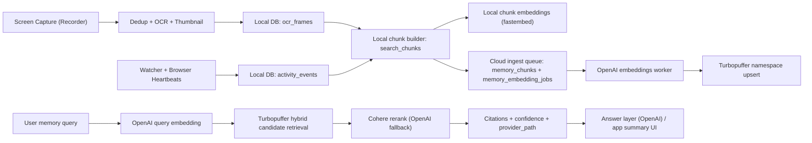

# Ritual Recorder -> OCR -> Chunking -> Embeddings -> Vector/Hybrid Search -> AI Summary

Date: 2026-03-04
Scope: Current architecture and operational status in `/Users/nickgardner/Desktop/ritual-desktop-main`

## Executive Summary

Your vector/hybrid stack is partially working in production-like conditions, but not yet fully stable:

- Cloud indexing is active and materially populated.
- Cloud retrieval path (`Turbopuffer + Cohere rerank + OpenAI answer`) is wired in backend code.
- Backlog is still significant (coverage below 90%), with a persistent failed-job tail.
- Local watcher/recorder SQLite write contention still exists and can leak into capture quality and browser session quality.

Current assessment: **usable for many queries, not yet reliable enough for a hard production bar** without remaining reliability fixes.

---

## 1) End-to-End Architecture (Current)

---

## 2) Stage-by-Stage Details

### Stage A: Recorder capture + OCR persistence

Primary flow:

- `apps/desktop/src-tauri/bin/ritual-recorder/src/main.rs`
  - Trigger-driven capture loop with idle fallback.
  - Multi-signal dedup (`screen_change`, `app_or_window_change`, `activity_event_change`, `idle_fallback`).
  - OCR extraction and thumbnail generation for stored frames.
  - Writes `OcrFrame` rows to unified local DB.

- `apps/desktop/src-tauri/bin/ritual-recorder/src/ocr.rs`
  - macOS Vision OCR (native) with fallback path.
  - Circuit-breaker controls around repeated OCR failures.

- `apps/desktop/src-tauri/bin/ritual-recorder/src/database.rs`
  - Persists OCR frames in ritual DB compatible tables.

Important behavior:

- Video is intentionally removed to reduce storage pressure; retrieval quality depends heavily on OCR + chunk quality.

### Stage B: Watcher/browser activity persistence

Primary flow:

- `apps/desktop/src-tauri/bin/ritual-watcher/src/main.rs`
  - Activity session tracking and heartbeats.
  - Coalesced end-time updates (`coalesce_end_update_ms`).

- `apps/desktop/src-tauri/bin/ritual-watcher/src/browser_heartbeat_server.rs`
  - Browser extension heartbeat ingest.
  - Single-writer command channel (`BrowserDbCommand`) to avoid direct DB writes from heartbeat thread.
  - Duplicate guards for rapid same-session creates.

Important behavior:

- Structural improvements are present (writer channel, coalescing, duplicate guard), but lock errors are still observed in runtime logs.

### Stage C: Local chunking + local embeddings

Primary flow:

- `apps/desktop/src-tauri/crates/ritual-db/src/vector.rs`
  - Rebuilds `search_chunks` from OCR/activity context.
  - Chunk parameters:
    - `CHUNK_BREAK_GAP_MS = 90_000`
    - `CHUNK_MAX_SPAN_MS = 120_000`
    - `CHUNK_TEXT_MAX_LEN = 2500`
  - Maintains durable chunk queue in `chunk_embeddings`.
  - Embeds with local `fastembed` (`all-MiniLM-L6-v2`, dim 384).

Important behavior:

- This local embedding path is separate from cloud embeddings.
- Local retrieval still exists and is used as fallback/local bridge.

### Stage D: Cloud memory ingest + queue

Primary flow:

- `apps/backend/services/memory_backfill_service.py`
  - Reads local `search_chunks` from ritual DB.
  - Feeds cloud ingest in batches.

- `apps/backend/services/memory_ingest_service.py`
  - Inserts into `memory_chunks`.
  - Enqueues `memory_embedding_jobs`.

- `apps/backend/services/memory_cloud_store.py`
  - SQLite WAL queue store (`.memory_cloud.db`).
  - Watermarks and query observability tables.

Important behavior:

- Current architecture is mostly catch-up/backfill-oriented, not strict real-time push from recorder.

### Stage E: Cloud embedding + upsert

Primary flow:

- `apps/backend/services/memory_embedding_service.py`
  - Uses **OpenAI embeddings** (`text-embedding-3-small` by default).
  - Upserts vectors to Turbopuffer using provider doc IDs.
  - Manages retries/backoff and stale-processing recovery.

- `apps/backend/services/memory_turbopuffer_service.py`
  - Upsert and query client.
  - Robust row parse supports both:
    - attributes nested under `attributes`
    - attributes at top-level.

Important behavior:

- Yes: cloud embeddings are currently OpenAI-based in backend worker, not desktop fastembed.

### Stage F: Vector/Hybrid retrieval and rerank

Primary flow:

- `apps/backend/services/memory_cloud_query_service.py`
  - Query embedding (OpenAI).
  - Candidate retrieval (Turbopuffer hybrid/ANN/BM25 paths).
  - RRF-like normalization, then rerank.
  - Emits `retrieval_tier`, `citations`, `confidence`, and `provider_path`.

- `apps/backend/services/memory_rerank_service.py`
  - Cohere rerank primary.
  - OpenAI fallback when needed.

- `apps/backend/services/watcher_service_search.py`
  - Chooses retrieval tier and fallback paths.
  - Auto backfill/drain logic when cloud index is lagging.

### Stage G: AI summary/answer layer

- Retrieval pipeline explicitly marks:
  - `provider_path.retrieval = turbopuffer`
  - `provider_path.rerank = cohere|openai`
  - `provider_path.answer = openai`
- Final user-facing answer synthesis is downstream of retrieval payload, with citations/confidence as grounding inputs.

---

## 3) What Is Working Right Now

1. Cloud memory DB is populated and active.
2. Embeddings worker is processing and upserting (not stalled).
3. Turbopuffer integration is live (doc IDs are being assigned and persisted).
4. Hybrid query stack is implemented end-to-end in backend code.
5. Cohere rerank integration is implemented with fallback.
6. Local fallback retrieval remains available.

---

## 4) Live Health Snapshot (from current local backend DB)

Source: `apps/backend/.memory_cloud.db` + `get_memory_index_health()`.

- `memory_chunks (total)`: **11,430**
- `embedded_chunks`: **9,682** (subsequent direct table read showed **9,717**)
- `pending_jobs`: **685** (table read later: **650**)
- `failed_jobs`: **1,063**
- `coverage`: **0.8471** (~84.7%)
- `embedding_lag_seconds`: **229**

Status distribution (latest direct read):

- `memory_embedding_jobs`: `ok=9717`, `pending=650`, `failed=1063`
- `memory_chunks.embedding_status`: `ok=9717`, `pending=1713`
- `distinct provider_doc_id`: **9,717**

Local desktop semantic state (ritual local DB):

- `search_chunks`: **7,000**
- `chunk_embeddings ok`: **5,222**
- `chunk_embeddings pending`: **1,778**

Interpretation:

- Cloud and local semantic indexes are both functioning but still in catch-up mode.
- Backlog/failed tail is large enough to impact consistency for edge/long-tail queries.

---

## 5) What Is Not Working / Bottlenecks

### 5.1 SQLite write contention still occurs (high severity)

Symptoms:

- Runtime logs still show intermittent `database is locked` from watcher/browser-session update paths.

Impact:

- Session boundary quality degrades (missed close/update).
- Browser session creation/merge can become noisy under contention.

### 5.2 Index catch-up behavior still noisy (high severity)

Symptoms:

- Coverage remains below 90% for sustained periods.
- Auto-backfill/drain improves throughput but still leaves persistent pending/failed tail.

Impact:

- Users can query recent data that is not yet represented in cloud vector index.

### 5.3 Persistent failed job tail (high severity)

Symptoms:

- `failed_jobs` at 1k+ scale.

Impact:

- Long-tail recall gaps unless those rows are reprocessed/recovered.

### 5.4 Duplicate same-domain browser session edge cases (medium severity)

Symptoms:

- Duplicate guards exist but session duplication still appears in some timing windows.

Impact:

- Potential inflation/noise in activity evidence and chunk source quality.

### 5.5 Observability currently underused (medium severity)

Symptoms:

- `memory_query_observations` had no recent rows in my snapshot, so grounded-rate and tier distribution cannot be validated from data.

Impact:

- Hard to prove SLO compliance before GA.

### 5.6 CI coverage gap for retrieval quality (medium severity)

- CI (`.github/workflows/ci.yml`) runs compile/typecheck/lint/cargo check but does **not** run backend pytest golden retrieval gates.
- This weakens regression protection for retrieval quality changes.

---

## 6) Is Turbopuffer “9.15k documents” Accurate?

Short answer: **very likely yes, and it is directionally consistent with your pipeline state.**

Why:

- Current backend queue DB shows **9,717 distinct `provider_doc_id`** already assigned/upserted locally.
- Your dashboard screenshot shows ~**9.15k documents** and ~**9.06k rows written**.
- Differences are expected due to:
  - timing (dashboard snapshot vs current local processing point),
  - namespace/account aggregation behavior,
  - in-flight upserts/deletes/eventual dashboard refresh timing.

So the `9.15k` figure is plausible and not a red flag by itself.

---

## 7) Production Readiness (Current)

If production-ready means users can ask arbitrary recorder-history questions and consistently receive grounded, complete answers:

- Current state: **not yet fully ready**.
- Current quality: **good for many recent/common queries**, weaker for long-tail and “just happened” windows while backlog exists.

Primary blockers to clear before Friday:

1. Reduce lock error rate to near-zero in watcher/recorder shared DB writes.
2. Drain pending backlog and remediate failed tail aggressively.
3. Stabilize browser session dedup under rapid same-domain heartbeats.
4. Turn on retrieval SLO monitoring and confirm real usage metrics.
5. Add retrieval-quality tests into CI (not just local/manual runs).

---

## 8) Practical Definition of “Done” for This Feature

Target operational thresholds:

- Cloud coverage >= **95%** sustained.
- Pending jobs < **200** sustained during active usage.
- Failed jobs either near-zero or auto-recovered with bounded retry latency.
- Retrieval tier distribution dominated by `cloud_hybrid` for semantic intents.
- Grounded citation rate >= **60%** on semantic queries.
- Lock-error rate < **1%** of DB write attempts in watcher path.

When those are met, your OCR->vector/hybrid->answer pipeline should feel predictably useful to end users.
