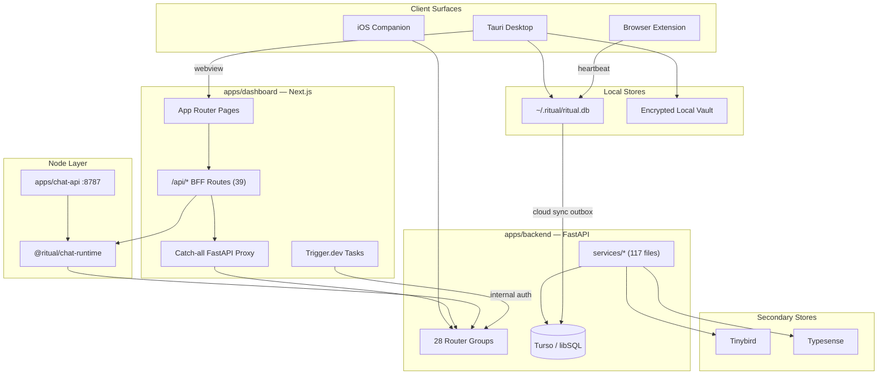

# Ritual — Current Architecture

**Status:** Living document (Pass 1 inventory)
**Date:** 2026-07-02
**Scope:** Documentation only — no application code was changed to produce this document.

This document describes the **current** architecture of the `ritual-desktop-main` monorepo as it exists today. For proposed simplifications, see [deepening-opportunities.md](./deepening-opportunities.md).

---

## Table of contents

1. [Executive summary](#executive-summary)
2. [Domain glossary](#domain-glossary)
3. [Monorepo structure](#monorepo-structure)
4. [System topology](#system-topology)
5. [Applications](#applications)
6. [Shared packages](#shared-packages)
7. [Data architecture](#data-architecture)
8. [Authentication & authorization](#authentication--authorization)
9. [Integrations architecture](#integrations-architecture)
10. [Background jobs & async work](#background-jobs--async-work)
11. [CI guardrails & quality gates](#ci-guardrails--quality-gates)
12. [Known architectural tensions](#known-architectural-tensions)
13. [Authoritative vs stale documentation](#authoritative-vs-stale-documentation)

---

## Executive summary

Ritual is a **multi-surface personal data platform** spanning macOS desktop, web (desktop-only in production), iOS companion, and a FastAPI backend. Users track habits, computer activity, wearables, finances, and workflows; an AI layer provides chat, SMS copilot, and proactive insights.

The architecture is **not an unmanaged ball of mud** — there is an active remediation program (`docs/thermo-nuclear-remediation-plan.md`), CI guardrails (`npm run repo:check`), and several successful refactors (thin backend entry, split database models, plugin registry for integrations, extracted chat runtime). However, the system has accumulated **parallel implementations**, **oversized modules**, and **cross-runtime sprawl** (especially in wearables, privacy/vault, and watcher/activity domains).

**Primary pattern:** Next.js dashboard acts as a **Backend-for-Frontend (BFF)**; almost all browser API calls go through `/api/*` routes that proxy to FastAPI. Desktop wraps the same dashboard in Tauri and adds native capabilities (local DB, activity watcher, encrypted vault, sidecars).

**Primary datastore:** Turso/libSQL (cloud + embedded replica). Analytics fan-out to Tinybird; search to Typesense.

---

## Domain glossary

Shared language for navigating this codebase. Terms are used consistently in [deepening-opportunities.md](./deepening-opportunities.md).

| Term | Definition |
|------|------------|
| **BFF** | Backend-for-Frontend — Next.js `/api/*` routes that proxy, enrich, or boundary-guard calls to FastAPI |
| **Catch-all proxy** | `app/api/[...backendPath]/route.ts` — OpenAPI-allowlisted forwarder to FastAPI |
| **Materialization cascade** | When upstream data (wearables, watcher, imports) projects into habit logs, metric facts, and analytics |
| **Wearables unified ingest** | Canonical ingest path under `services/wearables_unified/`; legacy `wearables_service.py` has been removed |
| **Watcher** | macOS activity capture subsystem: Rust sidecar (`ritual-watcher`) + `ritual-db` + backend projection |
| **Cloud sync outbox** | Desktop plaintext JSON queue (`cloud_sync.rs`) uploading local activity rows to per-user Turso |
| **Local vault** | Encrypted on-device record store reached through `VaultSync` (WebCrypto and Tauri production adapters) |
| **Write outbox** | Local-first pattern: mutate local state first, replay creates/updates to backend asynchronously |
| **Fan-out** | Single user write triggering secondary copies (Tinybird, Typesense, metric facts, WebSocket, etc.) |
| **Per-user Turso** | Isolated libSQL database per user for high-volume activity data (`turso_user_service.py`) |
| **Integration plugin** | Self-contained UI module for a third-party connection (Whoop, Plaid, Tesla, etc.) |
| **Integration orchestrator** | Central React layer wiring shared deps into typed plugin-owned runtime contexts |
| **Chat runtime** | `@ritual/chat-runtime` — shared AI turn engine, tools, SMS handlers used by dashboard and chat-api |
| **Desktop capabilities** | `useDesktopCapabilities()` — canonical boundary for detecting and invoking Tauri features |
| **Trigger.dev job** | Scheduled cloud task (wearable sync, Plaid, Tesla, proactive SMS) calling backend with internal auth |

---

## Monorepo structure

```
ritual-desktop-main/
├── apps/
│   ├── dashboard/          # Next.js 16 — primary UI + BFF + Trigger.dev
│   ├── backend/            # Python FastAPI — system of record
│   ├── desktop/            # Tauri 2 + Rust (ritual-db, ritual-watcher sidecar)
│   ├── chat-api/           # Hono Node service for chat streaming (partial migration)
│   ├── ios-companion/      # Swift/SwiftUI — HealthKit, Screen Time, location
│   ├── browser-extension/  # Chrome MV3 — browser context → local watcher
│   └── tinybird/           # ClickHouse analytics pipes/datasources
├── packages/
│   ├── chat-runtime/       # Shared AI chat turn engine
│   ├── shared-contracts/   # Cross-surface TypeScript DTOs
│   └── ui/                 # Shared UI utilities (minimal — `cn()` only)
├── docs/                   # Architecture, privacy, security, guides
├── scripts/                # CI guardrails, codegen, release tooling
├── tools/                  # Manifests (API routes, ops, performance budgets)
└── mintlify/               # External product docs (MDX)
```

### npm workspaces

Only four roots are npm workspaces:

- `apps/chat-api`
- `apps/dashboard`
- `apps/browser-extension`
- `packages/*`

**Not in npm workspaces** (managed separately): `apps/backend` (Python/uvicorn), `apps/desktop` (Rust/Tauri), `apps/ios-companion` (Swift/Tuist), `apps/tinybird` (ClickHouse).

Most frontend dependencies are **hoisted to root** `package.json` (~130 deps). Individual app `package.json` files are thin wrappers.

### Common commands

| Command | Purpose |
|---------|---------|
| `npm run dev` | Dashboard on port 3000 (builds chat-runtime first) |
| `npm run dev:backend` | FastAPI on port 8000 |
| `npm run dev:chat-api` | Hono chat service on port 8787 |
| `npm run tauri:dev` | Desktop shell (expects dashboard on :3000) |
| `npm run repo:check` | Full CI gate suite (16 checks) |
| `npm run typecheck` | contracts + chat-runtime + dashboard TS |
| `npm run api:openapi && npm run api:generate-client` | Regenerate backend TS client |

---

## System topology



### Request flow (typical dashboard action)

1. User interacts with React page in `(dashboard)` route group.
2. Client hook calls `lib/api/client.ts` → fetch to `/api/...`.
3. BFF route validates Clerk session, forwards to FastAPI with Bearer token.
4. FastAPI router delegates to service layer → SQLAlchemy → Turso.
5. Service may fan-out to Tinybird, Typesense, WebSocket, metric facts (async or inline).
6. Response returns through BFF to React Query cache.

### Request flow (desktop-native action)

1. Dashboard detects Tauri via `useDesktopCapabilities()`.
2. UI calls `invokeDesktopCommand()` → Tauri command in `main.rs`.
3. Rust module reads/writes `ritual-db` or encrypted vault.
4. Background workers drain outboxes (`cloud_sync.rs`, `biome_outbox.rs`, `location_outbox.rs`) to backend or Turso.

---

## Applications

### apps/dashboard — Next.js 16 (primary UI + BFF)

**Role:** Product UI, API boundary, OAuth callbacks, import parsing, analytics queries, Trigger.dev host.

**Entry points:**

| File | Role |
|------|------|
| `app/layout.tsx` | Root layout, fonts, Sentry, providers |
| `app/(dashboard)/layout.tsx` | Auth-gated shell, activation bootstrap |
| `proxy.ts` | Clerk middleware; blocks non-desktop browser in production |
| `components/root-providers.tsx` | ClerkProvider, React Query, desktop bridge |

**Route groups (31 pages):**

- Core product: `dashboard`, `analytics`, `activity`, `chat`, `calendar`, `integrations`, `reports`, `tasks`, `routines`, `workflows`, `approvals`
- Auth/onboarding: `sign-in`, `sign-up`, `onboarding`, `auth/callback`, `auth/desktop-*`
- Desktop-specific: `desktop-only`, `desktop/bootstrap`, `settings-window`, `widget`, `sidebar`

**BFF API routes (39 — at CI budget cap):**

Categories from `tools/dashboard-api-routes.manifest.json`:

| Category | Purpose |
|----------|---------|
| `backend-catchall` | OpenAPI-matched FastAPI proxy |
| `analytics-boundary` | Tinybird pipe queries (8 routes) |
| `ai-streaming` | Chat stream, SMS, voice |
| `import-boundary` | File import parsing |
| `oauth-callback` | Whoop, Plaid, Tesla OAuth returns |
| `webhook` | Sendblue, Clerk webhooks |

**Key `lib/` domains (101 files):**

| Path | Responsibility |
|------|----------------|
| `lib/api/client.ts` | Browser → `/api/*` (no direct backend URL) |
| `lib/api/server-client.ts` | Server components → backend URL |
| `lib/api/trigger-client.ts` | Trigger.dev → backend with consent checks |
| `lib/api/generated/backend-client.ts` | OpenAPI-generated typed client |
| `lib/desktop-capabilities.tsx` | Canonical Tauri detection/invocation |
| `lib/desktop-bridge/commands.ts` | `invokeDesktopCommand()` wrapper |
| `lib/computerActivity/*` | Local-first + Tauri + backend aggregation |
| `lib/privacy/*` | Vault adapters, private sync, migration (~15 modules) |
| `lib/tasks/*` | Tasks/routines local-first writes + outbox |
| `lib/ai/*` | Agents, overview activity |
| `lib/tinybird-service.ts` | Server-side Tinybird queries |

**Largest dashboard files (approaching/exceeding 800-line CI budget):**

| File | ~Lines | Concern |
|------|-------:|---------|
| `lib/privacy/ritual-vault-export.ts` | 794 | Export + migration |
| `lib/privacy/vault-private-sync.ts` | 768 | Sync orchestration |
| `lib/computerActivity/api.ts` | 796 | Activity client/API |
| `hooks/use-habits-query.ts` | 776 | Habits query + mutations + outbox |
| `app/(dashboard)/reports/reports-client.tsx` | 768 | Reports UI orchestration |
| `app/(dashboard)/activity/logs-client.inner.tsx` | 799 | Habit logs page |
| `components/habit-logs-search-filter.tsx` | 733 | Filter UI + state |
| `components/apple-watch-settings.tsx` | 718 | Wearable settings |
| `use-chat-voice-input.ts` / `use-ai-habit-voice.ts` | ~552 each | Near-duplicate voice hooks |

---

### apps/backend — FastAPI (system of record)

**Role:** Auth validation, CRUD, wearables ingest, watcher projection, AI conversations, workflows, SMS, privacy API, financial data, location.

**Entry points:**

| File | Lines | Role |
|------|------:|------|
| `main.py` | 68 | Sentry init, calls `create_app()` |
| `app_factory.py` | 332 | Router registration, auth, health, WebSocket |
| `database/connection.py` | 389 | SQLAlchemy async over Turso/libSQL |

**Router groups (28 registered in `app_factory.py`):**

| Router | Module | Domain |
|--------|--------|--------|
| Core | `api/core.py` | Habits, logs, users, bootstrap |
| Wearables | `api/wearables.py` + subroutes | Apple Health, Whoop, Oura, Garmin |
| Screen time | `api/screen_time.py` | iPhone Screen Time rollups |
| Watcher | `api/watcher.py` (5 sub-routers) | Desktop activity ingest/projection |
| Integrations | `api/integrations.py` | Whoop OAuth, Tesla |
| Financial | `api/financial.py` | Plaid connections/transactions |
| Imports | `api/imports.py` | CSV/spreadsheet import orchestration |
| Conversations | `api/conversations.py` | AI chat history |
| Workflows | `api/workflows.py` | Automation definitions/runs |
| Tasks | `api/tasks.py` | Tasks and routines |
| Search | `api/search.py` | Typesense federation |
| Analytics | `api/analytics.py` | Server-side analytics composition |
| Metric facts | `api/metric_facts.py` | Read-model projection |
| Facts | `api/facts.py` | AI memory/facts |
| Privacy | `api/privacy.py` | Vault sync, migration inventory |
| SMS | `api/sendblue.py`, `proactive_sms.py`, `sms_copilot.py`, `sms_preferences.py` | Sendblue integration |
| Location | `api/location.py` | Location pings/state |
| Reports | `api/reports.py` | Generated reports |
| Artifacts | `api/artifacts.py` | Report artifacts |
| Approvals | `api/approvals.py` | Workflow approval gates |
| Action profiles | `api/action_profiles.py` | Workflow action configs |
| Biometrics | `api/biometrics.py` | Heart rate sessions |
| Screenshot | `api/screenshot.py` | Screenshot analysis |
| Observability | `api/observability.py` | Health/metrics endpoints |
| UI preferences | `api/ui_preferences.py` | User UI settings |
| VCard | `api/vcard.py` | Contact card generation |

**Watcher sub-routers** (prefix `/api/watcher`):

- `watcher_devices`, `watcher_activity`, `watcher_biome`, `watcher_stats`, `watcher_project_time`

**Service layer (`services/` — 118 files):**

Largest modules:

| Service | ~Lines | Responsibility |
|---------|-------:|----------------|
| `metric_facts_service.py` | 1,708 | Metric facts rebuild/projection |
| `search_service.py` | 1,703 | Typesense search federation |
| `analytics_service.py` | 1,287 | Analytics query composition |
| `habits_service.py` | 1,251 | Habits CRUD + fan-out |
| `turso_user_service.py` | 1,208 | Per-user Turso DB provisioning |
| `workflow_service.py` | 1,151 | Workflow execution |
| `import_service.py` | 1,138 | Import orchestration |
| `watcher_service_projection.py` | 1,074 | Watcher → analytics projection |
| `tinybird_service.py` | 987 | Tinybird writes/queries |

**Service subpackages:**

- `wearables_unified/` — canonical ingest, device security, and Apple ingest routing
- `computer_activity/` — activity aggregation helpers
- `location/` — location processing
- `wearable_provider_clients/` — provider API clients

**Database models** (`database/models/` — 18 domain files):

`user`, `habits`, `imports`, `wearables`, `watcher`, `conversations`, `facts`, `artifacts`, `reports`, `workflows`, `financial`, `sms`, `tasks`, `integrations`, `metrics`, `privacy_sync`

**Tests:** 60 files, ~10,079 lines under `apps/backend/tests/`.

---

### apps/desktop — Tauri 2 macOS shell

**Role:** Native shell hosting dashboard webview; local activity capture, encrypted vault, cloud sync, auto-updater, sidecar processes.

**Rust workspace** (`apps/desktop/src-tauri/Cargo.toml`):

- Root crate `app` v0.1.80
- Members: `.`, `crates/ritual-db`, `bin/ritual-watcher`

**Sidecars** (`tauri.conf.json` externalBin):

| Binary | Purpose |
|--------|---------|
| `ritual-watcher` | Activity/accessibility tracking |
| `ritual-vision-helper` | Vision/OCR helper for watcher |
| ~~`ritual-recorder`~~ | **Removed** (CI enforced) |

**Tauri command groups (~60 commands in `main.rs`, 1,669 lines):**

| Group | Examples |
|-------|----------|
| Window/shell | `show_main_window`, `open_settings_window`, `sidebar_*` |
| Auth bridge | `desktop_set_auth_token`, `write_auth_token_to_file`, `write_turso_sync_config` |
| Native speech | Mic permission, speech recognition (10 commands) |
| Watcher permissions | Accessibility settings, permission checks (8 commands) |
| Watcher lifecycle | `start_watcher`, `stop_watcher`, config save/clear/reconcile |
| Watcher queries | `get_detailed_activity`, `get_daily_summaries` |
| Watcher diagnostics | Extension diagnostics, app icons, hung-watcher restart |
| Updater/runtime | `desktop_manual_update_check`, `desktop_install_update`, biome iPhone sync |
| Local vault | `vault_initialize`, `vault_put/get/list/tombstone_record`, migration manifests |
| ritual-db | `init_ritual_database`, `text_search`, project-time attribution/retention |

**Background workers:**

- `cloud_sync.rs` (709 lines) — drains activity outbox to per-user Turso
- `desktop_runtime/location_outbox.rs` — location ping drain
- `desktop_runtime/biome_outbox.rs` — iPhone Screen Time bridge drain

**`ritual-db` crate (22 modules):**

`activity`, `context`, `recorder`, `project_time`, `sync`, `migration`, `schema/*`, `text_processing`, `vault`

**Largest Rust files:**

| File | ~Lines |
|------|-------:|
| `main.rs` | 1,669 |
| `bin/ritual-watcher/src/macos/accessibility.rs` | 1,921 |
| `crates/ritual-db/src/project_time.rs` | 1,136 |
| `crates/ritual-db/src/context.rs` | 1,036 |
| `crates/ritual-db/src/activity.rs` | 1,097 |
| `src/watcher/lifecycle.rs` | 865 |

---

### apps/chat-api — Hono chat service

**Role:** Dedicated Node service for chat streaming (partial migration from Next.js).

| File | Role |
|------|------|
| `src/server.ts` | Port 8787 |
| `src/routes/chat.ts` | `GET /healthz`, `POST /chat/stream` |
| `src/lib/auth.ts` | Clerk JWT via `jose` |

**Status:** Workspace member with dev/build scripts. **Not in CI workflow.** Dashboard still serves chat via Next routes. Migration plan: `docs/analysis/chat-api-service-migration-plan-2026-04-17.md`.

---

### apps/ios-companion — Swift/Tuist

**Role:** Apple Health, Screen Time, location pings, BLE Whoop, local exports, backend upload.

**56 Swift source files** across Services, Views, Extensions.

**Largest files:**

| File | ~Lines |
|------|-------:|
| `BackgroundSyncManagerV2.swift` | 2,217 |
| `HealthKitManagerV2.swift` | 1,593 |
| `RitualAPIClient.swift` | 1,102 |
| `AppState.swift` | 1,064 |

**Auth:** Clerk iOS SDK.

---

### apps/browser-extension — Chrome MV3

**Role:** Browser tab/page context → local watcher heartbeat.

**10 files:** background service worker, popup, heartbeat to `127.0.0.1:8766/8767`.

---

### apps/tinybird — ClickHouse analytics

**Role:** Time-series analytics pipes and datasources.

**33 files:**

- **7 datasources:** habit_logs, computer_activity_daily, heart_rate_1m_rollups, weather_observations, whoop_sleep/recovery/workout_data
- **16 pipes:** habit analytics, heart rate, computer activity, Whoop, correlation, streaks

**Note:** `apps/tinybird/README.md` still references Supabase (stale).

---

## Shared packages

### @ritual/chat-runtime

**47 files.** Exports chat turn engine, SMS handlers, tools, narrative, weekly overview utils.

**Largest modules:** `sms.ts` (739), `system-prompt.ts` (337), `tools.ts` (308)

**Consumers:**

- Dashboard: `app/api/chat/stream`, SMS routes, `lib/workflows/executor.ts`
- Chat API: `POST /chat/stream`

### @ritual/shared-contracts

**7 TypeScript modules.** Exports habits, wearables-unified, apple ingest, computer-activity, privacy policy helpers.

**Adoption:** ~13 dashboard imports. iOS Swift mirrors types manually. Backend uses parallel Pydantic schemas.

### @ritual/ui

**2 files.** Exports `cn()` utility only. **No direct consumers found** in TS/TSX beyond tsconfig path alias.

---

## Data architecture

### Primary transactional store — Turso/libSQL

```
Clients → Dashboard BFF → FastAPI → SQLAlchemy → Turso Cloud
                                              ↓
                                   turso_user_service (per-user DBs)
                                              ↓
Desktop ritual-db (local libSQL) → cloud_sync outbox → per-user Turso
```

- Backend connection: `apps/backend/database/connection.py`
- Desktop local DB: `~/.ritual/ritual.db`
- Per-user rollout: `docs/guides/per-user-turso-rollout.md`

### Analytics — Tinybird

```
Habit logs, computer activity, heart rate, Whoop
    → tinybird_service.py → Tinybird Events API
Dashboard analytics routes → lib/tinybird-service.ts → Tinybird pipes
Trigger.dev jobs → backend sync → eventual Tinybird writes
```

### Search — Typesense

Indexed via `search_service.py` (1,703 lines): habits, logs, AI content, artifacts, workflows, facts, activity.

### Local encrypted vault

```
Dashboard lib/privacy/local-vault.ts (WebCrypto AES-GCM)
    ↔ Tauri vault_* commands (Rust)
    ↔ Vault adapters: habit-vault-adapter.ts, task-vault-adapter.ts

Record types: habit_definition, habit_log, daily_note,
              computer_activity, health_metric, ai_content
```

**Status:** Partial local-first for habits/tasks. Cloud Turso remains source of truth for most domains. See `docs/privacy/00-current-architecture-audit.md`.

### Outbox patterns

| Outbox | Location | Purpose |
|--------|----------|---------|
| Task/routine write outbox | `lib/tasks/local-first-writes.ts` | Replay creates/updates to backend |
| Habit write outbox | `lib/privacy/habit-vault-adapter.ts` | Local vault → cloud replay |
| Wearable event outbox | `services/wearables_unified/outbox.py` | Internal wearable signals |
| Watcher sync outbox | `WatcherSyncOutboxDB` model | Desktop activity cloud upload |
| Desktop cloud sync outbox | `ritual-db` + `cloud_sync.rs` | Plaintext JSON → Turso |
| Location outbox | `desktop_runtime/location_outbox.rs` | Location ping drain |
| Biome outbox | `desktop_runtime/biome_outbox.rs` | iPhone Screen Time drain |
| iOS location outbox | `LocationPingOutbox.swift` | Offline location pings |
| iOS offline sync | `OfflineSyncQueue.swift` | General upload queue |

### Fan-out (habit write example)

A single habit log create in `habits_service.py` can trigger:

1. Turso insert (primary)
2. Tinybird event write
3. Typesense index update
4. Metric facts projection
5. WebSocket notification
6. OpenPanel analytics event

This is the highest-risk architectural tension for privacy and consistency. Documented in `docs/privacy/00-current-architecture-audit.md`.

---

## Authentication & authorization

| Surface | Mechanism | Key file |
|---------|-----------|----------|
| Dashboard web/desktop webview | `@clerk/nextjs` — ClerkProvider, middleware | `proxy.ts`, `root-providers.tsx` |
| Dashboard BFF | `auth()` → Bearer token to backend | `lib/server/proxy-helper.ts` |
| Desktop native handoff | Tauri `desktop_set_auth_token` | `desktop_runtime/auth_handoff.rs` |
| Backend API | JWT via Clerk JWKS | `services/auth_service.py` |
| Backend internal | `INTERNAL_BACKEND_TOKEN` + `x-internal-user-id` | `app_factory.py` |
| Trigger.dev | `INTERNAL_API_KEY` header | `src/trigger/*.ts` |
| Chat API | Bearer JWT via `jose` + JWKS | `apps/chat-api/src/lib/auth.ts` |
| iOS companion | Clerk iOS SDK | `Project.swift` |
| WebSocket | Clerk token in header or query | `app_factory.py` `/ws/{user_id}` |

**Production access control:** Dashboard blocks non-desktop browser access (`proxy.ts`) except public routes (sign-in, OAuth callbacks, webhooks).

---

## Integrations architecture

### Plugin registry

**Location:** `apps/dashboard/app/(dashboard)/integrations/plugins/`

**Registered plugins (6):**

| Plugin ID | Detail key | Provider | Module |
|-----------|------------|----------|--------|
| `computer` | `computer` | Desktop activity tracking | `computer-tracking/` |
| `apple-screen-time` | `screentime` | iPhone Screen Time | `iphone-time/` |
| `apple-watch` | `applewatch` | Apple Health / Watch | `apple-health/` |
| `whoop` | `whoop` | Whoop OAuth + sync | `whoop/` |
| `plaid` | `plaid` | Financial connections | `plaid/` |
| `tesla` | `tesla` | Tesla vehicle data | `tesla/` |

**Plugin contract** (`plugins/types.ts`):

```typescript
IntegrationPlugin {
  id, detailKey, title, keywords?,
  buildCard(ctx: PluginOwnedCardContext),
  DetailPanel({ ctx: PluginOwnedDetailContext }),
  PanelAction?({ ctx: PluginOwnedDetailContext }),
  useIntegration?(deps: IntegrationOrchestratorDeps)
}
```

**Orchestration layer (14+ files):**

- `integrations-client.impl.tsx` — main orchestrator
- `integrations-client.details.tsx`, `.shared.helpers.tsx`, `.wearable-details.tsx`
- `integrations-client.legacy-wearables.ts` — legacy handlers (migration target)
- Per-plugin hooks: `use-whoop-integration.ts` (~470 lines), `use-plaid-integration.ts`, etc.

**Backend counterparts:** wearables routes, financial router, integrations router (Whoop/Tesla), screen_time router, watcher router.

**Current boundary:** `IntegrationPlugin` is generic over plugin-owned card/detail contexts. Registry entries use `satisfies readonly IntegrationPlugin[]`; the old Whoop `as unknown as IntegrationPlugin` cast is gone.

---

## Background jobs & async work

### Trigger.dev (dashboard-hosted)

**Config:** `apps/dashboard/trigger.config.ts` — project `proj_hctghowrtnzbnyrgoecx`

**6 scheduled tasks** (`src/trigger/`):

| Task | Schedule | Backend endpoint |
|------|----------|------------------|
| `whoop-sync` | Hourly | Wearables sync |
| `oura-sync` | Hourly | Wearables sync |
| `garmin-sync` | Hourly | Wearables sync |
| `plaid-sync` | Hourly | Financial sync |
| `tesla-sync` | Hourly | Tesla data pull |
| `proactive-sms` | Configurable | Proactive SMS generation |

Pattern: `triggerBackendFetch()` with `INTERNAL_API_KEY` + privacy consent checks.

### Backend background workers

- Wearable event outbox replay
- Watcher projection pipeline
- Metric facts rebuild jobs

### Desktop background workers

- Cloud sync outbox drain
- Location outbox drain
- Biome (iPhone Screen Time) outbox drain

---

## CI guardrails & quality gates

**Master gate:** `npm run repo:check` runs 16 checks:

| Check | Purpose |
|-------|---------|
| `check-repo-structure.sh` | Required apps exist |
| `check-dead-code.mjs` | Entrypoint reachability |
| `check-removed-recorder.sh` | Recorder sidecar forbidden |
| `check-dashboard-api-budget.mjs` | Max 39 BFF routes |
| `check-dashboard-api-manifest.mjs` | Route manifest sync |
| `check-runtime-schema-budget.mjs` | Chat runtime schema limits |
| `check-backend-ops-manifest.mjs` | Backend script lifecycle |
| `check-migration-boundary.mjs` | Alembic vs ad-hoc scripts |
| `check-generated-backend-client.mjs` | OpenAPI client freshness |
| `check-import-cycles.mjs` | Dashboard import graph |
| `check-no-direct-backend-fetch.mjs` | No `localhost:8000` in client code |
| `check-desktop-capabilities-boundary.mjs` | `isTauri()` allowlist |
| `check-dashboard-line-budget.mjs` | 800 lines/file (CI) |
| `check-rust-line-budget.mjs` | 1000 lines/file (allowlist) |
| `check-performance-budgets.mjs` | Tracked file caps |

**Remediation program:** `docs/thermo-nuclear-remediation-plan.md` — phased refactor with per-phase gates. Principle: *"One canonical path per concern."*

---

## Known architectural tensions

### 1. Parallel implementations (dual paths)

| Domain | Path A (legacy) | Path B (new) |
|--------|-----------------|--------------|
| Chat serving | Next `/api/chat/stream` | `apps/chat-api` |
| Habit writes | Cloud-first via BFF | Local vault + outbox |
| Migrations | Alembic | `scripts/migrate_*.py` ad-hoc |

### 2. Oversized modules (god files)

10+ backend services exceed 1,000 lines. Dashboard has 10+ files approaching 800-line budget. Desktop `main.rs` is 1,669 lines. iOS has 4 files over 1,000 lines.

### 3. Cross-runtime sprawl

Privacy/vault spans dashboard TS (~15 modules), backend Python (`privacy.py`, `privacy_*` services), and desktop Rust (`local_vault.rs`, outboxes) with no single facade or state machine diagram.

### 4. BFF route budget at cap

39/39 routes. New routes require deleting/migrating existing ones.

### 5. Analytics boundary in Next.js

8 Tinybird query routes live in dashboard rather than FastAPI. Manifest notes: *"until analytics is fully moved behind FastAPI."*

### 6. Underused shared contracts

`@ritual/shared-contracts` has limited adoption. iOS and backend maintain parallel type definitions.

### 7. Fan-out without coordination

Single writes trigger multiple secondary stores without transactional guarantees or unified deletion semantics.

---

## Authoritative vs stale documentation

### Trust these

| Document | Why |
|----------|-----|
| `README.md` (root) | Post-remediation architecture table |
| `docs/thermo-nuclear-remediation-plan.md` | Active refactor program |
| `docs/privacy/00-current-architecture-audit.md` | Detailed storage/fan-out inventory (2026-06-23) |
| `docs/privacy/01–18-*.md` | Privacy implementation notes |
| `tools/dashboard-api-routes.manifest.json` | CI-enforced |
| `tools/performance/budgets.json` | CI-enforced |
| `docs/guides/environment-setup.md` | Onboarding |
| **This document** | Current architecture inventory |

### Treat with caution

| Document | Issue |
|----------|-------|
| `docs/ARCHITECTURE-ANALYSIS.md` | Feb 2026; references removed recorder, 3,447-line main.py |
| `apps/tinybird/README.md` | References Supabase (now Turso) |
| `docs/guides/start-here.md` | Marketing doc; partial migration claims |
| Thermo plan baseline table | Says 1,900-line budget; CI now uses 800 |

---

## Related documents

- [deepening-opportunities.md](./deepening-opportunities.md) — Proposed refactors using deep-module design vocabulary
- [../thermo-nuclear-remediation-plan.md](../thermo-nuclear-remediation-plan.md) — Active remediation program
- [../privacy/00-current-architecture-audit.md](../privacy/00-current-architecture-audit.md) — Privacy/storage deep dive
