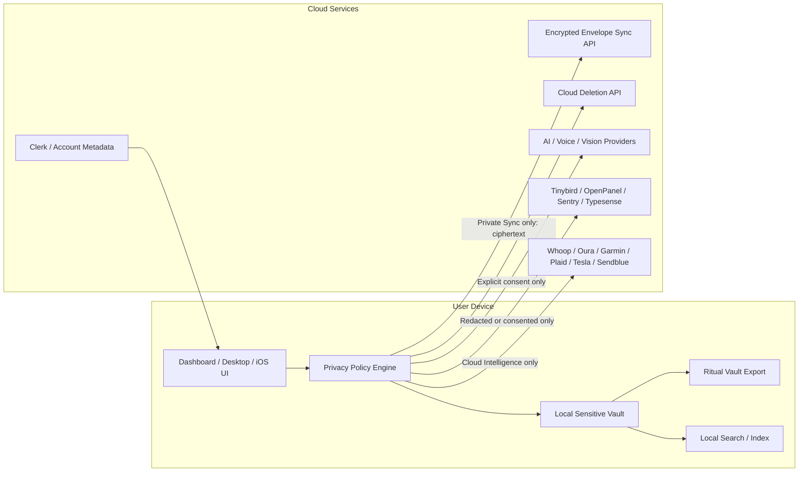

# Local-First E2EE Vault Implementation Plan

Date: 2026-06-23

## Recommendation

No-proceed for a single big-bang implementation of the original full scope.

Proceed with a staged implementation. Current Ritual features depend on cloud primary storage, Tinybird, Typesense, Trigger.dev, provider webhooks/schedules, OpenAI/Gemini/Groq/Deepgram, SMS delivery, and generated cloud artifacts. Forcing local-first/E2EE over all of that at once would break important current features and leave hidden secondary copies.

Pass 2 should begin with Stage 1 only unless explicitly expanded: privacy settings, data guardrails, sensitive fan-out shutoff, verification tooling, and a narrow local vault foundation. Later stages can add migration, cloud deletion, File-over-App export, and optional E2EE sync.

## Privacy Modes

Ritual should have three explicit user-visible modes:

| Mode | Default? | Behavior |
|---|---:|---|
| Local Only | Yes for new sensitive data | Sensitive data stays on device. AI, Tinybird, Typesense, provider background sync, cloud reports, OpenPanel sensitive props, and desktop cloud sync are off. |
| Private Sync | Opt-in | Sensitive records sync as client-encrypted envelopes. Server stores ciphertext and minimal metadata only. AI/analytics still off unless separately enabled. |
| Cloud Intelligence | Opt-in per feature | User allows specific plaintext or derived data to leave the device for AI, analytics, search, provider sync, SMS, reports, or support diagnostics. |

Mode transitions must be explicit:

- Local Only to Private Sync: create/recover vault key, pair device or enter recovery phrase, show what metadata syncs.
- Private Sync to Local Only: stop remote sync, keep local vault, offer remote encrypted envelope deletion.
- Any mode to Cloud Intelligence: per-feature consent with a preview of data classes sent.
- Cloud Intelligence off: stop future sends and offer deletion of cloud behavioral data.

## Target Architecture



## Data Classification

Implement a shared classification enum and policy helper across dashboard/backend/desktop/iOS:

| Class | Examples | Local Only default | Private Sync eligible | Cloud Intelligence eligible |
|---|---|---:|---:|---:|
| Account metadata | Clerk user ID, email, subscription/account state | No | No | Required for account |
| App preferences | theme, layout, non-sensitive settings | Yes | Yes | Optional |
| Sensitive behavioral | habit names/logs/notes, scheduled blocks, imports | Yes | Yes | Explicit |
| Health/biometric | HealthKit, Whoop/Oura/Garmin, HR, sleep, workouts | Yes | Yes | Explicit |
| Location | lat/lon, BSSID/SSID, place labels | Yes | Yes | Explicit, short retention |
| Computer activity | apps, titles, URLs, OCR, visible text, project-time | Yes | Yes, with redaction options | Explicit |
| AI content/memory | conversations, tool payloads, facts, artifacts | Yes | Yes | Explicit per AI feature |
| Financial | Plaid tokens/accounts/transactions/spending rollups | Yes | Yes | Explicit |
| Provider secrets | access/refresh/device tokens | Local keychain or backend secret store only | Prefer no | Explicit connection |
| Product telemetry | feature events, crashes, performance | Redacted only | Not needed | Explicit or minimal |

Policy rule: code should not decide "is this safe to send?" locally in each feature. It should ask one policy surface with data class, destination, purpose, and retention.

## Stage 1: Privacy Guardrails and Baseline Controls

Goal: stop new sensitive leakage before moving storage.

Implementation scope:

- Add `PrivacyMode` and `CloudConsent` settings visible in desktop/dashboard and iOS.
- Add a shared policy module with checks such as `canSend(dataClass, destination, purpose)`.
- Gate Tinybird writes for habit logs, computer activity, heart-rate rollups, wearable projections, and Whoop sinks.
- Gate Typesense indexing of sensitive documents.
- Gate OpenPanel event properties so habit names, log IDs, emails, profile names, and free-text values are not sent by default.
- Gate Sentry user email and high-risk tags in local/privacy modes; keep crash telemetry minimal and redacted.
- Gate desktop `cloud_sync_outbox` worker and prevent plaintext outbox uploads by default.
- Gate AI/voice/vision calls behind explicit per-use consent.
- Gate Trigger.dev provider syncs for users in Local Only or Private Sync without Cloud Intelligence.
- Add backend deletion endpoint skeletons and dry-run inventory for all behavioral copies.
- Add privacy verification script that fails if sensitive destinations are reachable without an allowlisted consent path.

Tests:

- Unit tests for policy decisions by mode/class/destination.
- Backend tests proving Tinybird/Typesense/AI/provider sync calls are skipped in Local Only.
- Dashboard tests proving OpenPanel receives redacted props.
- Desktop tests proving cloud sync does not upload plaintext outbox rows when Local Only.
- iOS tests proving upload clients respect privacy mode where available.

Acceptance criteria:

- New sensitive habit/log/activity/health/location/AI data does not leave device/backend boundary in Local Only.
- Existing feature calls fail closed or show consent prompts rather than silently sending data.
- Verification script reports no unguarded sensitive egress paths known from this audit.

## Stage 2: Local Sensitive Vault Foundation

Goal: create a local source of truth for sensitive records without breaking cloud-backed legacy flows.

Recommended implementation:

- Add a local `RitualVault` storage layer in desktop first, backed by a separate vault database/file rather than immediately mutating existing `ritual.db`.
- Use record-level encryption for sensitive payloads, with keys protected by platform keychain/secure storage.
- Keep minimal unencrypted indexes only where necessary: opaque record ID, record type, updated time, tombstone, sync state, and optional coarse date bucket.
- Add local vault APIs for habits, logs, import staging, artifacts, AI conversations/facts, and activity summaries.
- Add a compatibility read path so existing UI can read from local vault when present and backend otherwise.
- Add iOS vault equivalents for HealthKit/screen-time/location queues and exports; at minimum encrypt offline queues and biometrics/location local stores.
- Do not rely solely on Turso transparent encryption or remote database encryption. Use application-level encryption for any record that may enter sync, logs, outboxes, or backups.

Notes:

- Current desktop `ritual-db` is a good local SQL foundation but is not encrypted and currently has plaintext cloud outbox triggers.
- Turso reference review showed local at-rest encryption is experimental and omitted from the sync builder path. That makes record/envelope encryption the safer invariant.
- A later stage can consolidate `ritual.db` and vault DB once the new path is stable.

Tests:

- Vault create/open/lock/unlock.
- Key rotation metadata.
- Encrypted-at-rest record assertions: plaintext habit/log/OCR strings do not appear in vault payload blobs.
- Read/write compatibility tests for local habits/logs.
- Local search indexes do not store plaintext beyond user-approved local files.

## Stage 3: Migration From Current Cloud Data

Goal: move current cloud-stored behavioral data into the local vault safely.

Implementation scope:

- Add migration wizard:
  - inventory current cloud data by table/service;
  - show categories and counts;
  - download in batches;
  - write to local vault;
  - verify counts and hashes;
  - keep user in control before deletion.
- Cover primary tables:
  - users/profile fields that are behavioral, not account-required;
  - habits/logs/scheduled blocks/aliases/imports;
  - wearable raw payloads/samples/events/metrics/screen time/heart-rate;
  - location pings/state;
  - watcher activity/rollups/outbox;
  - conversations/messages/facts/artifacts/reports/workflows/SMS/copilot/financial.
- Cover secondary services:
  - Tinybird datasources by user ID;
  - Typesense collections by user ID;
  - per-user Turso DBs and replicas;
  - Trigger.dev job logs where available;
  - OpenPanel user/event deletion where available;
  - Sentry user/event deletion where feasible, or disable future association and document retention limits.
- Store a signed local migration manifest in the vault.
- Do not delete cloud data until local verification passes and the user confirms.

Tests:

- Idempotent migration: rerun does not duplicate logs.
- Partial failure resume.
- Hash/count verification.
- Dry-run deletion inventory.
- Deletion confirmation requires explicit user action.

## Stage 4: Cloud Behavioral Data Deletion Controls

Goal: make "delete cloud behavioral data" real, observable, and safe.

Implementation scope:

- Add backend deletion service that deletes by user across:
  - backend Turso tables;
  - per-user Turso databases;
  - Tinybird datasources;
  - Typesense collections;
  - generated artifacts/reports/workflows/conversations/facts;
  - provider raw payload/debug/job tables;
  - SMS/copilot records;
  - financial transactions/accounts where user revokes local/cloud financial features.
- Preserve only account-required metadata unless the user deletes account:
  - Clerk ID/user ID;
  - email if account remains;
  - billing/subscription state if later added;
  - deletion receipts.
- Add user-facing deletion status:
  - dry run counts;
  - in-progress;
  - completed;
  - failed with retryable details.
- Add immutable local deletion receipt to the vault.

Tests:

- Table-by-table deletion coverage.
- Tinybird/Typesense deletion mocks.
- Idempotent deletion.
- Account metadata survives behavioral deletion.
- Full account deletion cascades where intended.

## Stage 5: File-over-App Ritual Vault Export

Goal: make user data durable outside the app.

Recommended formats:

```text
Ritual Vault/
  manifest.json
  schema/
    ritual-vault.schema.json
  habits/
    habits.json
    aliases.json
  logs/
    2026/
      2026-06.jsonl
  days/
    2026/
      2026-06-23.md
  artifacts/
    reports/
    workflows/
    ai/
  health/
    apple-health/
    wearables/
  activity/
    daily-rollups.jsonl
    project-time.jsonl
  imports/
    runs.jsonl
  attachments/
  checksums.sha256
```

Default export behavior:

- Always include user-readable Markdown/JSON/JSONL for habit definitions, logs, daily summaries, artifacts, and migration manifests.
- Include raw provider payloads, raw location, browser URLs, window titles, OCR, screenshots, visible text, conversations, and AI facts only behind explicit sensitive-export toggles.
- Offer encrypted archive option for full sensitive export.
- Keep a stable schema version and documented import contract.
- Make export repeatable so users can keep the folder in iCloud/Dropbox/Syncthing/Git if they choose.

Tests:

- Round-trip export/import.
- Schema validation.
- Checksums.
- Sensitive-default exclusion tests.
- Large vault streaming export.

## Stage 6: Optional E2EE Private Sync

Goal: sync sensitive data without the server seeing plaintext.

Envelope model:

```json
{
  "account_id": "clerk_or_internal_user_id",
  "device_id": "device",
  "collection": "habit_logs",
  "item_id": "opaque_or_hmac_id",
  "revision": 42,
  "schema_version": 1,
  "key_version": 3,
  "nonce": "base64",
  "ciphertext": "base64",
  "aad": {
    "collection": "habit_logs",
    "item_id": "opaque_or_hmac_id",
    "schema_version": 1
  },
  "tombstone": false,
  "updated_at": "2026-06-23T00:00:00Z"
}
```

Server responsibilities:

- Authenticate user/device.
- Store encrypted envelopes and tombstones.
- Enforce quotas and revision ordering.
- Return deltas by collection/device/revision.
- Never decrypt sensitive payloads.
- Never build Tinybird/Typesense indexes from ciphertext.

Client responsibilities:

- Generate/store vault root key.
- Derive collection/item keys.
- Encrypt/decrypt records.
- Resolve conflicts locally.
- Maintain recovery key/device pairing.
- Rebuild local search and analytics from decrypted local data.

Key management:

- New vault root key generated on first Private Sync setup.
- Protect key in platform keychain.
- Recovery phrase or recovery file for user-controlled restore.
- Device pairing through QR or one-time code encrypted to device public key.
- Key rotation metadata and multi-key decrypt support.

Tests:

- Server never receives plaintext payloads in sync tests.
- Multi-device conflict resolution.
- Key rotation.
- Device revoke.
- Recovery restore.
- Tombstone deletion.
- Offline edit then sync.

## Stage 7: AI and Analytics Refactor

Goal: make cloud intelligence useful without making it ambient and implicit.

Implementation scope:

- Add an AI consent modal that shows data classes and examples before each high-risk action.
- Add per-feature toggles:
  - chat can use local habit/log summaries;
  - chat can use desktop activity;
  - chat can use health;
  - chat can use location;
  - screenshots/voice/import image extraction;
  - proactive SMS;
  - workflow artifact synthesis.
- Add local summary builders so AI can receive narrow summaries instead of raw logs where possible.
- Add disclosure log in the vault: destination, purpose, data classes, timestamp, record count, user action.
- Replace Tinybird-sensitive analytics with local analytics in Local Only/Private Sync.
- Tinybird becomes either disabled or aggregate/redacted product analytics unless Cloud Intelligence is on.
- Typesense becomes local search or encrypted/local-only index; remote Typesense disabled for sensitive docs.

Tests:

- No OpenAI/Gemini/Groq/Deepgram call without consent.
- Prompt redaction and data-minimization snapshots.
- Disclosure log written for every approved AI/cloud action.
- Analytics falls back to local queries in Local Only.

## Privacy Verification Script

Add a script such as `scripts/privacy/verify-privacy-guards.ts` or a repo-native equivalent.

Checks:

- Search for direct `TinybirdService`, Typesense, OpenPanel `track`, Sentry user/email, OpenAI/Gemini/Groq/Deepgram calls, provider sync calls, and desktop cloud sync uploads.
- Require each sensitive egress call to pass through the policy helper or an explicit allowlist with justification.
- Fail if code sends habit names, notes, raw AI text, URL/title/OCR, health samples, location, financial transactions, or tokens to unapproved destinations.
- Scan desktop sync triggers/outbox payload schema for plaintext sensitive fields.
- Scan iOS upload/offline queue callers for policy checks.
- Produce a machine-readable report and a human summary.

## Proposed Pass 2A Scope

If approved, the smallest useful implementation pass should be:

1. Add privacy settings model and UI.
2. Add shared data classification/policy helpers.
3. Gate Tinybird, Typesense, OpenPanel, Sentry identity, AI/voice/vision, Trigger/provider sync, and desktop cloud sync.
4. Add local vault skeleton and encrypted record helper for a narrow pilot: habit definitions and habit logs.
5. Add privacy verification script.
6. Add tests for all gates and the pilot vault.
7. Update docs with limitations and staged roadmap.

Do not start full cloud migration, deletion, or E2EE sync until Pass 2A guardrails are working.

## Open Questions Before Implementation

- Should Local Only become the default for all existing users immediately, or only after a migration wizard?
- Which current cloud features are allowed to degrade in Local Only: web dashboard, provider syncs, SMS, reports, chat, analytics?
- What recovery UX is acceptable for E2EE: recovery phrase, recovery file, trusted-device pairing, or all three?
- Should the first local vault live only in desktop, or must web/iOS launch simultaneously?
- Which sensitive raw data should never be exported by default: URLs, window titles, OCR, visible text, raw provider payloads, raw location?
- What retention SLA should deletion controls promise for Tinybird, Typesense, Sentry, OpenPanel, and Trigger.dev?

## Approval Gate

Human approval is required before Pass 2.

Recommended approval wording if this staged plan is acceptable:

`Approved for Pass 2A: implement privacy guardrails and local vault pilot only.`

If the intended scope is broader, specify exactly which later stages to include.
