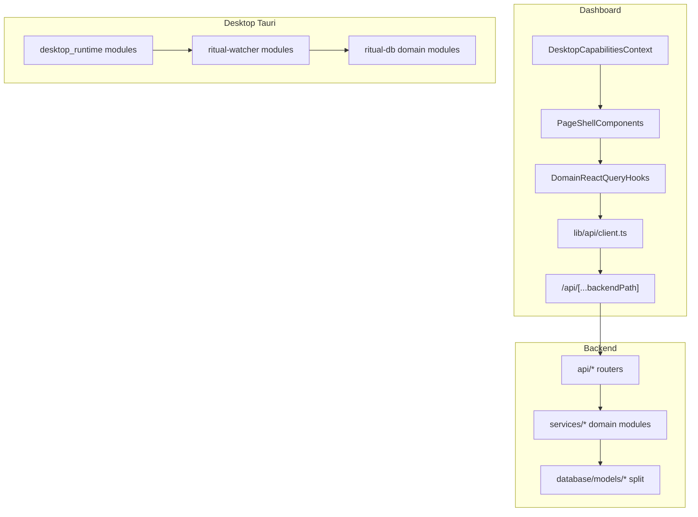
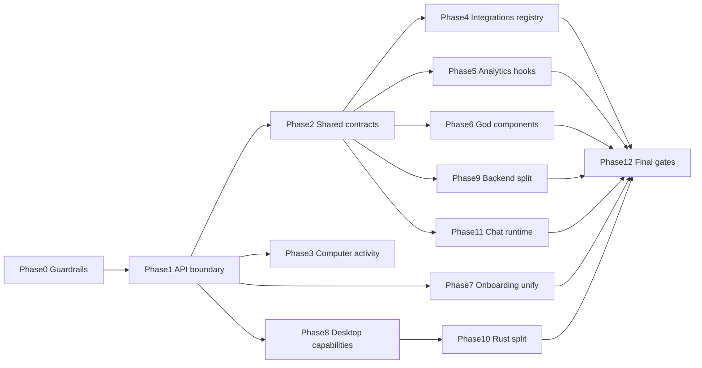

# Thermo-Nuclear Codebase Remediation Plan (Codex 5.5)

## How Codex should execute this plan

1. Read CLAUDE.md and this file fully before coding.
2. Work ONE phase at a time. Confirm phase number in PR title: `refactor(phase-N): ...`
3. Before editing: `git checkout -b refactor/phase-N-short-name`
4. During phase: run that phase's gate after each logical commit.
5. Do not start phase N+1 until phase N is merged to main.
6. Prefer deleting code over adding wrappers.
7. If a phase scope explodes, split into N.1/N.2 PRs — never skip gates.
8. Never disable CI checks or eslint rules to pass gates.
9. Regenerate OpenAPI client when backend routes change: `npm run api:openapi && npm run api:generate-client`
10. Update tools/dashboard-api-routes.manifest.json when adding/removing Next API routes.

---

This plan turns the Thermo-Nuclear review into an executable program.

**Deliverable:** After approval, write the full document to [docs/thermo-nuclear-remediation-plan.md](docs/thermo-nuclear-remediation-plan.md) (copy of this plan, expanded with file lists and checklists).

**User decisions locked in:**
- Plan lives in repo at `docs/thermo-nuclear-remediation-plan.md`
- Legacy onboarding (`legacy-activation-onboarding.tsx`) **may be deleted** once V3 + backend bootstrap fully cover activation routes

---

## Program principles (Codex must follow)

1. **Behavior-preserving refactors only** unless a phase explicitly deletes legacy code (Phase 7).
2. **Delete complexity, don't redistribute it.** File splits must reduce concepts per file, not just move lines.
3. **One canonical path per concern:** API calls, onboarding activation, desktop capabilities, wearable ingest.
4. **No file may grow past 1,000 lines** during this program; existing offenders must shrink each phase they touch.
5. **Every PR ends green** on the verification gate for that phase (see bottom).
6. **One phase = one PR** (or a small stacked PR series within the same phase). Never mix phases.

---

## Current baseline (as of review)

| Metric | Value |
|--------|------:|
| Files >= 1,000 lines (TS/Py/Rs, excl. venv) | 44 |
| Dashboard line budget (CI) | 1,900 lines/file ([scripts/check-dashboard-line-budget.mjs](scripts/check-dashboard-line-budget.mjs)) |
| Dashboard API route budget (CI) | 39 routes ([scripts/check-dashboard-api-budget.mjs](scripts/check-dashboard-api-budget.mjs)) |
| Direct `NEXT_PUBLIC_PYTHON_API_URL` usages in dashboard | 15+ files |
| Backend tests | 52 files under [apps/backend/tests/](apps/backend/tests/) |
| CI backend pytest (subset only) | 5 test modules in [.github/workflows/ci.yml](.github/workflows/ci.yml) |

**Target end state:**

| Metric | Target |
|--------|--------|
| Files >= 1,000 lines | 0 in dashboard TS; <= 5 allowed in Rust schema/macos with documented justification |
| Dashboard per-file budget | 800 lines (tighten CI gradually in Phase 0) |
| Direct client `PYTHON_API_BASE` fetches | 0 in `apps/dashboard` client components/hooks (server/trigger exempt with typed internal client) |
| `Record<string, any>` god-contexts | 0 |
| Legacy onboarding | deleted |
| Full backend pytest | runs in CI |

---

## Architecture target (end state)



---

## Phase order and dependencies



Phases 4–6 can run in parallel **after Phase 2** if different agents own them; still merge independently.

---

## Phase 0 — Guardrails and baselines

**Goal:** Make regressions impossible while refactoring.

**Work:**
- Capture baseline: run full verification suite (see Final Verification), save output to `docs/remediation/baseline-YYYY-MM-DD.txt`
- Add [scripts/check-no-direct-backend-fetch.mjs](scripts/check-no-direct-backend-fetch.mjs):
  - Fail if `apps/dashboard` client code (`'use client'` files, hooks, components) contains `NEXT_PUBLIC_PYTHON_API_URL` or `127.0.0.1:8000` except allowlist: `lib/server/*`, `app/api/*`, `src/trigger/*`, `lib/api/client.ts`
- Add script to [package.json](package.json) as `repo:check:api-client-boundary`
- Wire into `repo:check` and [.github/workflows/ci.yml](.github/workflows/ci.yml)
- Stage line-budget tightening: add env `RITUAL_DASHBOARD_FILE_LINE_BUDGET_STRICT=800` script; keep CI at 1900 until Phase 12, then flip to 800
- Document per-phase PR template in the md file (Summary / Files touched / Gates run / Manual QA)

**Do not refactor product code in Phase 0.**

**Phase 0 gate:** `npm run repo:check` passes with new script (allowlist covers current violations).

---

## Phase 1 — Canonical API client (highest leverage)

**Goal:** One browser API path: React Query hooks and components call `/api/...` only.

**Create:**
- [apps/dashboard/lib/api/client.ts](apps/dashboard/lib/api/client.ts) — typed fetch wrapper using relative `/api` paths, credentials, read-consistency headers ([apps/dashboard/lib/read-consistency.ts](apps/dashboard/lib/read-consistency.ts))
- [apps/dashboard/lib/api/server-client.ts](apps/dashboard/lib/api/server-client.ts) — for Route Handlers / server components: uses [apps/dashboard/lib/server/proxy-helper.ts](apps/dashboard/lib/server/proxy-helper.ts)
- [apps/dashboard/lib/api/trigger-client.ts](apps/dashboard/lib/api/trigger-client.ts) — for [apps/dashboard/src/trigger/*](apps/dashboard/src/trigger/) with service env vars

**Migrate (grep-driven, complete all):**
- [apps/dashboard/hooks/use-habits-query.ts](apps/dashboard/hooks/use-habits-query.ts)
- [apps/dashboard/lib/services/analytics-api.ts](apps/dashboard/lib/services/analytics-api.ts)
- [apps/dashboard/components/apple-watch-settings.tsx](apps/dashboard/components/apple-watch-settings.tsx)
- [apps/dashboard/app/(dashboard)/calendar/calendar-client.tsx](apps/dashboard/app/(dashboard)/calendar/calendar-client.tsx)
- [apps/dashboard/app/(dashboard)/integrations/integrations-client.shared.tsx](apps/dashboard/app/(dashboard)/integrations/integrations-client.shared.tsx)
- [apps/dashboard/components/desktop-runtime-bridge.tsx](apps/dashboard/components/desktop-runtime-bridge.tsx) (server-side profile sync → server client or existing route)
- All other `NEXT_PUBLIC_PYTHON_API_URL` hits in dashboard

**Consolidate duplicate bespoke `/api/analytics/*` routes** where they mirror backend 1:1 and can use catch-all [apps/dashboard/app/api/[...backendPath]/route.ts](apps/dashboard/app/api/[...backendPath]/route.ts) — update [tools/dashboard-api-routes.manifest.json](tools/dashboard-api-routes.manifest.json) when removing routes.

**Tests to add:**
- Extend [apps/dashboard/tests/proxy-helper.test.mjs](apps/dashboard/tests/proxy-helper.test.mjs) for client.ts error mapping
- New `apps/dashboard/tests/api-client-boundary.test.mjs` (static scan mirror of Phase 0 script)

**Phase 1 gate:**
```bash
npm run repo:check:api-client-boundary
npm run typecheck && npm run lint && npm run test:dashboard
npm run build
```

---

## Phase 2 — Shared contracts and type boundaries

**Goal:** Hot paths stop using `any`; DTOs live in [packages/shared-contracts](packages/shared-contracts).

**Priority type migrations:**
- Habits: [apps/dashboard/contexts/HabitsContext.tsx](apps/dashboard/contexts/HabitsContext.tsx) — replace `createHabit: (habitData: any)` with `CreateHabitInput` from shared-contracts
- Computer activity responses: move types from [apps/dashboard/lib/computerActivity/client.ts](apps/dashboard/lib/computerActivity/client.ts) to shared-contracts (align with [packages/shared-contracts/src/computer-activity.ts](packages/shared-contracts/src/computer-activity.ts))
- Integrations connection DTOs
- Wearables dashboard types in [apps/dashboard/lib/wearables-dashboard.ts](apps/dashboard/lib/wearables-dashboard.ts)

**Backend:** Reduce `Any` in [apps/backend/services/watcher_service_computer_activity.py](apps/backend/services/watcher_service_computer_activity.py) and [apps/backend/services/wearables_unified/query.py](apps/backend/services/wearables_unified/query.py) with Pydantic models in [apps/backend/schemas/](apps/backend/schemas/)

**Tests:**
- `npm run contracts:typecheck && npm run contracts:build`
- Existing: [apps/backend/tests/test_watcher_computer_activity_snapshot.py](apps/backend/tests/test_watcher_computer_activity_snapshot.py), [apps/backend/tests/test_wearables_query_service.py](apps/backend/tests/test_wearables_query_service.py)

**Phase 2 gate:** typecheck + contracts + backend architecture tests (CI subset).

---

## Phase 3 — Computer activity policy extraction

**Goal:** [apps/dashboard/lib/computerActivity/client.ts](apps/dashboard/lib/computerActivity/client.ts) (1,314 lines) → thin public API.

**Split into:**
```
apps/dashboard/lib/computerActivity/
  policy.ts          # preferDesktopLocalAggregate, range constants, authority rules
  backend-read.ts    # fetchWatcherStatsJson, caches, dedupe
  tauri-fallback.ts  # invoke paths, fallback aggregate builder
  normalize.ts       # (existing) strict types, no any[]
  index.ts           # re-exports ~5 public functions
```

**Delete:** inline magic numbers from fetch helpers; single `COMPUTER_ACTIVITY_POLICY` export.

**Tests to add:** `apps/dashboard/tests/computer-activity-policy.test.mjs`
- Table-driven tests for `preferDesktopLocalAggregate`, range eligibility, empty backend + nonempty local
- Golden fixtures from [apps/backend/tests/test_computer_use_parity.py](apps/backend/tests/test_computer_use_parity.py) concepts

**Phase 3 gate:**
```bash
npm run test:dashboard
PYTHONPATH=apps/backend pytest -q apps/backend/tests/test_watcher_computer_activity_snapshot.py apps/backend/tests/test_computer_use_parity.py
```

---

## Phase 4 — Integrations plugin registry

**Goal:** Eliminate god-context in [integrations-client.details.tsx](apps/dashboard/app/(dashboard)/integrations/integrations-client.details.tsx) (1,248 lines). Total integrations ~5,266 lines → target <2,500.

**Create:**
- [apps/dashboard/app/(dashboard)/integrations/plugins/registry.ts](apps/dashboard/app/(dashboard)/integrations/plugins/registry.ts)
- One folder per integration: `plugins/whoop/`, `plugins/plaid/`, `plugins/tesla/`, `plugins/apple-health/`, `plugins/computer-tracking/`, `plugins/iphone-time/`
- Each plugin exports: `id`, `Card`, `DetailPanel`, `useIntegration` hook

**Refactor:**
- [integrations-client.impl.tsx](apps/dashboard/app/(dashboard)/integrations/integrations-client.impl.tsx) becomes orchestrator only (<400 lines)
- Delete `IntegrationDetailRendererContext = Record<string, any>`
- Move existing hooks ([use-plaid-integration.ts](apps/dashboard/app/(dashboard)/integrations/use-plaid-integration.ts), etc.) into plugin folders

**Tests to add:** `apps/dashboard/tests/integrations-registry.test.mjs` — registry completeness, no duplicate ids, each plugin renders smoke

**Phase 4 gate:** typecheck + test:dashboard + manual integrations smoke (see Manual QA matrix).

---

## Phase 5 — Analytics decomposition

**Goal:** Break analytics data layer from view monoliths.

**Targets:**
- [overview-view.tsx](apps/dashboard/components/analytics/overview-view.tsx) (1,487) → `overview/` folder: `OverviewView.tsx` (<200), `useOverviewMetrics.ts`, section components
- [metrics-view.impl.tsx](apps/dashboard/components/analytics/metrics-view.impl.tsx) (1,002) → same pattern
- Collapse effect hooks ([use-metrics-expanded-effects.ts](apps/dashboard/components/analytics/use-metrics-expanded-effects.ts), [use-metrics-data-effects.ts](apps/dashboard/components/analytics/use-metrics-data-effects.ts)) into React Query hooks with stable query keys

**Reuse:** [overview-view.helpers.ts](apps/dashboard/components/analytics/overview-view.helpers.ts), [metric-context-builder.ts](apps/dashboard/components/analytics/metric-context-builder.ts)

**Tests:** existing [metric-context-builder.test.mjs](apps/dashboard/tests/metric-context-builder.test.mjs), [overview-snapshot-merge.test.mjs](apps/dashboard/tests/overview-snapshot-merge.test.mjs), [wearables-dashboard.test.mjs](apps/dashboard/tests/wearables-dashboard.test.mjs)

**Phase 5 gate:** test:dashboard + `npm run perf:runtime` (no regression vs baseline from Phase 0).

---

## Phase 6 — God component bisection

**Goal:** No dashboard component >800 lines.

**Priority order (largest / most coupled first):**

| File | Lines | Split strategy |
|------|------:|----------------|
| [ai-habit-chat.tsx](apps/dashboard/components/ai-habit-chat.tsx) | 1,516 | Extend existing [ai-habit-chat/](apps/dashboard/components/ai-habit-chat/) subfolder; hooks for voice, screenshot, suggestions |
| [habit-selection-modal.tsx](apps/dashboard/components/habit-selection-modal.tsx) | 1,356 | `habit-selection/` modal shell + list + create form |
| [calendar-client.tsx](apps/dashboard/app/(dashboard)/calendar/calendar-client.tsx) | 1,356 | data hooks + week grid + composer |
| [data-table.tsx](apps/dashboard/components/tables/habit-logs/data-table.tsx) | 1,354 | columns (exists), filters, toolbar, table shell |
| [apple-watch-settings.tsx](apps/dashboard/components/apple-watch-settings.tsx) | 1,225 | move to integrations plugin or `settings/apple-watch/` |
| [data-import-modal.tsx](apps/dashboard/components/data-import-modal.tsx) | 1,222 | step components |
| [habit-logs-search-filter.tsx](apps/dashboard/components/habit-logs-search-filter.tsx) | 1,036 | filter sections |

**Phase 6 gate:** `RITUAL_DASHBOARD_FILE_LINE_BUDGET=800 node scripts/check-dashboard-line-budget.mjs` for touched files; full typecheck + build.

---

## Phase 7 — Onboarding unification (delete legacy)

**Goal:** Single activation flow; delete legacy.

**Work:**
- Make [apps/backend/services/activation_service.py](apps/backend/services/activation_service.py) + `/api/user/bootstrap` the **only** routing authority for post-auth next step
- Consolidate [onboarding/page.tsx](apps/dashboard/app/onboarding/page.tsx), [home-client.tsx](apps/dashboard/app/home-client.tsx), [auth/sso-callback/page.tsx](apps/dashboard/app/auth/sso-callback/page.tsx) to read `nextRoute` only — no parallel client-side step persistence except UX cache
- **Delete** [legacy-activation-onboarding.tsx](apps/dashboard/components/onboarding/legacy-activation-onboarding.tsx) and `?s=profile|first-behavior|connect` branches
- Migrate any legacy-only behavior into V3 steps or settings

**Tests:**
- [apps/dashboard/tests/activation-flow.test.mjs](apps/dashboard/tests/activation-flow.test.mjs)
- [apps/backend/tests/test_activation_service.py](apps/backend/tests/test_activation_service.py)
- [apps/backend/tests/test_user_service_onboarding_welcome.py](apps/backend/tests/test_user_service_onboarding_welcome.py)

**Manual QA:** full signup → permissions → dashboard on web + Tauri dev

**Phase 7 gate:** activation tests + delete legacy file + no references in grep.

---

## Phase 8 — Desktop capabilities context

**Goal:** Remove scattered `isTauri()` from UI; centralize in context.

**Create:** [apps/dashboard/lib/desktop-capabilities.tsx](apps/dashboard/lib/desktop-capabilities.tsx)
- Exposes: `isDesktop`, `canOpenPrivacyPane`, `oauthFlow`, `computerActivityFallback`, etc.
- Populated from [desktop-runtime-bridge.tsx](apps/dashboard/components/desktop-runtime-bridge.tsx) + [lib/desktop-runtime.ts](apps/dashboard/lib/desktop-runtime.ts)

**Migrate:** onboarding, integrations, analytics, chat, settings — replace raw `isTauri()` with capability flags

**Phase 8 gate:** grep `isTauri()` only allowed in `lib/tauri-utils.ts`, `lib/desktop-capabilities.tsx`, `desktop-runtime-bridge.tsx`, computer-activity policy (until Phase 10)

---

## Phase 9 — Backend decomposition

**Goal:** Split god files; wearables single entry point.

**9a — main.py (1,063 lines):**
- Extract `apps/backend/app_factory.py`, `lifespan.py`, `background_tasks.py`
- [main.py](apps/backend/main.py) <150 lines

**9b — database/models.py (1,777 lines):**
- Split to `apps/backend/database/models/{habits,wearables,watcher,financial,user,...}.py`
- Re-export from `models/__init__.py`

**9c — Wearables deprecation:**
- Route all new logic through [wearables_unified/](apps/backend/services/wearables_unified/)
- Shrink [whoop_service.py](apps/backend/services/whoop_service.py), [oura_service.py](apps/backend/services/oura_service.py), [garmin_service.py](apps/backend/services/garmin_service.py) to thin adapters; document deletion timeline in md

**9d — Watcher computer activity (1,802 lines):**
- Split `watcher_service_computer_activity.py` by concern: `query.py`, `sync.py`, `snapshot.py`

**CI expansion:** add full backend pytest job:
```bash
PYTHONPATH=apps/backend pytest -q apps/backend/tests
```

**Phase 9 gate:** compileall + full pytest + existing architecture tests.

---

## Phase 10 — Desktop Rust decomposition

**Goal:** Break Rust monoliths; preserve behavior.

**Priority files:**
- [macos.rs](apps/desktop/src-tauri/bin/ritual-watcher/src/macos.rs) (2,677) → `macos/{workspace,accessibility,window_title}.rs`
- [desktop_runtime.rs](apps/desktop/src-tauri/src/desktop_runtime.rs) (2,158) → `desktop_runtime/{turso_sync,biome_outbox,location_outbox,updater,auth_handoff}.rs`
- [watcher.rs](apps/desktop/src-tauri/src/watcher.rs) (2,135) → submodules
- [schema.rs](apps/desktop/src-tauri/crates/ritual-db/src/schema.rs) (1,878) → domain modules

**Verification:**
```bash
cargo check --manifest-path apps/desktop/src-tauri/Cargo.toml --locked
cargo test --manifest-path apps/desktop/src-tauri/Cargo.toml
npm run desktop:check:watcher   # requires local watcher + activity.db
npm run desktop:check:activity-audit
```

**Phase 10 gate:** cargo check + cargo test + desktop health scripts (document env prerequisites).

---

## Phase 11 — Chat runtime orchestrator split

**Goal:** [packages/chat-runtime/src/handle-chat-stream.ts](packages/chat-runtime/src/handle-chat-stream.ts) (1,070) → orchestrator + route handlers.

**Split:**
- `chat-stream/classifier-router.ts`
- `chat-stream/tool-dispatch.ts`
- `chat-stream/narrative-router.ts`
- `handle-chat-stream.ts` <200 lines wiring only

**Tests:**
```bash
npm run --workspace @ritual/chat-runtime test
npm run test:dashboard:orchestrator
npm run typecheck:chat-api
```

**Phase 11 gate:** chat-runtime tests + dashboard orchestrator test.

---

## Phase 12 — Final tightening and definition of done

**Work:**
- Flip CI dashboard line budget: `RITUAL_DASHBOARD_FILE_LINE_BUDGET=800` in [ci.yml](.github/workflows/ci.yml)
- Add Rust line budget script (optional, warn at 1000)
- Removed dead wearable compat facades: `unified_wearables_service.py` and `unified_wearables_service_impl.py`. Callers import `services.wearables_unified` directly.
- Update [README.md](README.md) architecture section (minimal — where API client, plugins, capabilities live)
- Re-run baseline comparison: line counts, `any` count, direct fetch count

---

## Codex operating instructions

Copy into top of `docs/thermo-nuclear-remediation-plan.md`:

```markdown
## How Codex should execute this plan

1. Read CLAUDE.md and this file fully before coding.
2. Work ONE phase at a time. Confirm phase number in PR title: `refactor(phase-N): ...`
3. Before editing: `git checkout -b refactor/phase-N-short-name`
4. During phase: run that phase's gate after each logical commit.
5. Do not start phase N+1 until phase N is merged to main.
6. Prefer deleting code over adding wrappers.
7. If a phase scope explodes, split into N.1/N.2 PRs — never skip gates.
8. Never disable CI checks or eslint rules to pass gates.
9. Regenerate OpenAPI client when backend routes change: `npm run api:openapi && npm run api:generate-client`
10. Update tools/dashboard-api-routes.manifest.json when adding/removing Next API routes.
```

---

## Verification matrix (run at program completion)

### Automated (must all pass)

| Command | Purpose |
|---------|---------|
| `npm run repo:check` | Structure, API manifest, import cycles, line budgets, generated client |
| `npm run repo:check:api-client-boundary` | No direct backend URL in client code |
| `npm run contracts:typecheck` | Shared DTO integrity |
| `npm run typecheck` | Dashboard TS |
| `npm run typecheck:chat-api` | Chat API TS |
| `npm run lint` | ESLint |
| `npm run test:dashboard` | All dashboard unit tests |
| `npm run --workspace @ritual/chat-runtime test` | Chat runtime |
| `npm run build` | Production Next build |
| `python -m compileall -q apps/backend` | Python syntax |
| `PYTHONPATH=apps/backend pytest -q apps/backend/tests` | **Full** backend suite |
| `cargo check --manifest-path apps/desktop/src-tauri/Cargo.toml --locked` | Rust compile |
| `cargo test --manifest-path apps/desktop/src-tauri/Cargo.toml` | Rust unit tests |

### Manual QA matrix (must pass before declaring complete)

| Flow | Web | Tauri desktop |
|------|-----|---------------|
| Sign up / SSO → onboarding V3 → dashboard | yes | yes |
| Log habit (AI chat + manual) | yes | yes |
| Analytics overview + metrics views | yes | yes |
| Computer activity stats (backend authority) | yes | yes + offline fallback |
| Integrations: connect/sync/disconnect Whoop | yes | yes |
| Integrations: Plaid link | yes | n/a |
| Calendar read/write | yes | yes |
| Habit logs table filter/sort | yes | yes |
| Desktop permissions pane from onboarding | n/a | yes |
| Watcher health (`npm run desktop:check:watcher`) | n/a | yes |

### Quantitative definition of done

- [ ] 0 files >800 lines in `apps/dashboard/**/*.ts(x)`
- [ ] 0 `NEXT_PUBLIC_PYTHON_API_URL` in client components/hooks (allowlist only)
- [ ] 0 `Record<string, any>` god-contexts in integrations
- [ ] `legacy-activation-onboarding.tsx` deleted
- [ ] `isTauri()` not used in dashboard components (capability context only)
- [ ] Full backend pytest in CI
- [ ] File count >=1000 lines reduced by at least 75% (44 → <=11, only Rust schema/macos/watcher allowed with justification doc in md)
- [ ] No new eslint-disable / @ts-ignore without ticket comment

---

## Suggested timeline (for planning, not blocking)

| Phase | Est. effort | Cumulative |
|-------|-------------|------------|
| 0 | 0.5 day | 0.5d |
| 1 | 2–3 days | 3.5d |
| 2 | 2 days | 5.5d |
| 3 | 1 day | 6.5d |
| 4 | 2–3 days | 9.5d |
| 5 | 2–3 days | 12.5d |
| 6 | 3–4 days | 16.5d |
| 7 | 1–2 days | 18.5d |
| 8 | 1 day | 19.5d |
| 9 | 3–4 days | 23.5d |
| 10 | 4–5 days | 28.5d |
| 11 | 1–2 days | 30.5d |
| 12 | 1 day | 31.5d |

**Total: ~6–7 weeks** of focused refactor work at one phase per PR merge cadence.

---

## Risk notes for Codex

- **Migration safety:** Backend model splits must not rename DB tables; Python re-exports only.
- **Desktop fallback:** Phase 3 policy tests are critical; do not simplify merge logic without parity tests.
- **API route budget:** Removing bespoke routes in Phase 1 may require manifest updates; do not exceed 39 routes.
- **Schema drift:** After Phase 9 model splits, run migration boundary check: `npm run repo:check:migration-boundary`
- **Do not commit:** `.env`, credentials, binary watcher builds unless explicitly part of release
